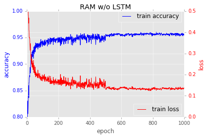

# Reccurent Attention Model

Reccurent Attention Model with Chainer based on the following paper  
[arXiv:1406.6247](http://arxiv.org/abs/1406.6247): Recurrent Models of Visual Attention [Volodymyr Mnih+ 2014]  

## Features  

* RAM model difinition file (Chainer)  
* script for training the model  

### not yet implemented  

* visualize the locations which the model predicted  
* hyper-params to get the best accuracy in the paper    
* multi-scale glimpse  
* models to solve "Translated MNIST" task  

## Dependencies  
Python(2 or 3), Chainer, scikit-learn, tqdm  

## Usage  

```shellsession
➜ python train.py   
```

If you use a GPU, add the option "-g `deviceID`".  
When you use LSTM units in core RNN layer, add the option "--lstm".  
(better performance but a little time consuming with LSTMs)  

```shellsession
➜ python train.py -g 0 --lstm  
```

After training, you can get predictions by the trained model.  

```shellsession
➜ python predict.py -m ram_wolstm.chainermodel  
```

## Examples  
Training the model without LSTM takes a day with CPU (reaches 96% accuracy)  


Training the model with LSTM takes ??? with CPU  
(still searching for the hyper-parameters to get the best accuracy in the paper...)
